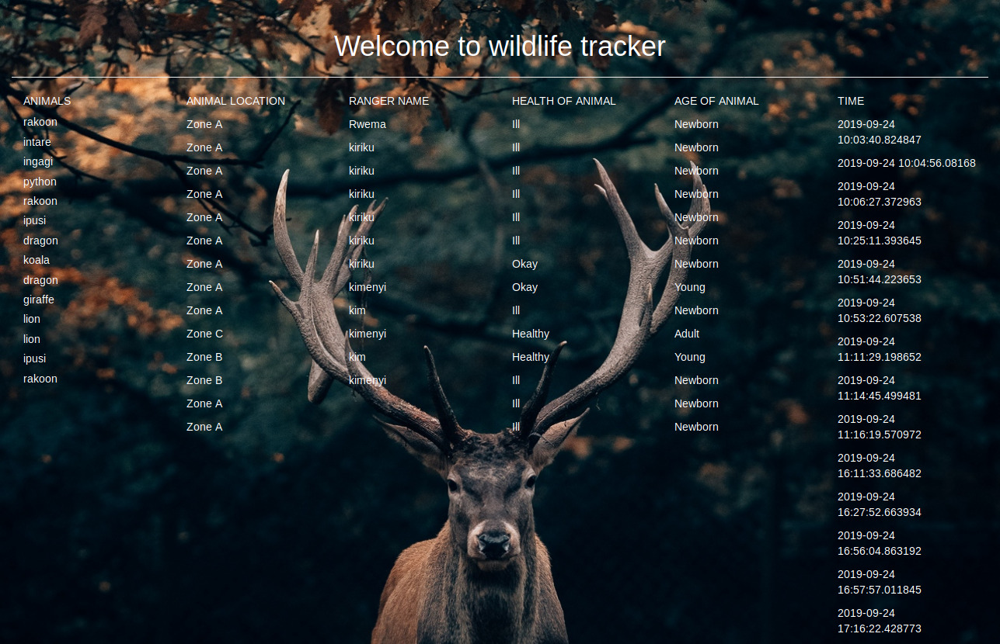

# wildlife-tracker

## Author 

KARAMBIZI Amandine Gloria

## Contents are the following

 - [x] App description
 - [x]  Technologies used
 - [x]  Installation
 - [x]  Contacts
 - [x]  License
### APPLICATION DESCRIPTION
 
 This application will allow the user(ranger) to track the animals by adding the animals name and it condition through the form, and it can be displayed the animals entered.
  Thus helping him to make the history of all the animals in the park . 
  
### TECHNOLOGIES USED
 
   + IntelliJ IDEA Community Edition
   + classes with extension java 
   
### Setup
 
   1. Install  IntelliJ IDEAL Community Edition
   2. Clone this repository
   3. Open it within IntelliJ 
   
   + CREATE DATABASE wildlife_tracker;
   + \c wildlife_tracker;
   + CREATE TABLE animals (id serial PRIMARY KEY, name varchar);
   + CREATE TABLE endangered_animals (id serial PRIMARY KEY, name varchar, health varchar, age varchar);
   + CREATE TABLE sightings (id serial PRIMARY KEY, location varchar, ranger_name varchar,date date);
   + CREATE DATABASE wildlife_tracker_test WITH TEMPLATE wildlife_tracker;
    
### CONTACTS
    
   +  Email:karambiziga@gmail.com
   +  Phone.Nbr:+250782398092 
    
### Picture of Application 
 
   
  
  
     
### LISENCE

- [x] MITCopyright &copy; [2019] Karambizi Amandine Gloria

